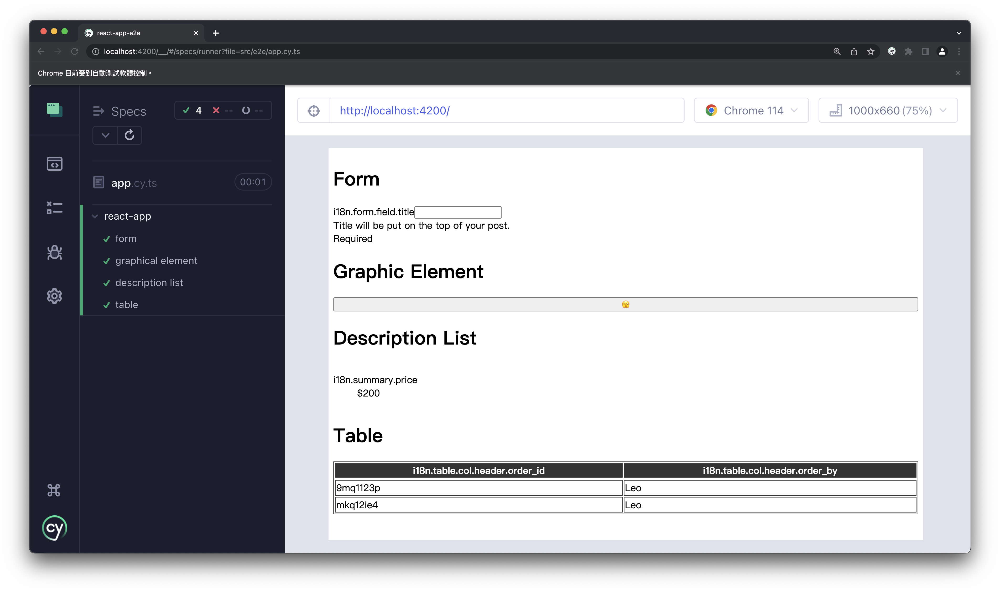

# Improve Testing Experience With A11y

1. `npm install`
1. `npx nx run react-app-e2e:e2e --watch`



## Form

```tsx
<form>
  <div>
    <label htmlFor="title" data-test-id="i18n.form.field.title">
      i18n.form.field.title
    </label>
    <input id="title" name="title" type="text" aria-describedby="title-error-message" />
  </div>
  <div id="title-error-message">Required</div>
</form>
```

- get input by label
- get error message by input

```ts
it('form', () => {
  // get input by label
  cy.get('[data-test-id="i18n.form.field.title"]').then(($label) => {
    const forInput = $label.attr('for');
    console.log(forInput);
    cy.get(`[name="${forInput}"]`).type('test');
  });

  // get error message by input
  cy.get('[name="title"]').then(($input) => {
    const id = $input.attr('aria-describedby');
    cy.get(`#${id}`).contains('Required');
  });
});
```

## Graphical Element

```tsx
<button
  aria-label="hide"
  onClick={() => {
    console.log('hide');
  }}
>
  🫣
</button>
```

- get visual indication by aria-label

```ts
it('graphical element', () => {
  // get visual indication by aria-label
  cy.get('[aria-label="hide"]').click();
});
```

## Description List

```tsx
<dl>
  <div>
    <div>
      <dt data-test-id="i18n.summary.price">i18n.summary.price</dt>
    </div>
    <dd>$200</dd>
  </div>
</dl>
```

- get description by term

```ts
it('description list', () => {
  // get description by term
  cy.get('[data-test-id="i18n.summary.price"]').closest('dl').find('dd').contains('$200');
});
```

## Table

```tsx
<table>
  <caption data-test-id="i18n.table.caption">i18n.table.caption</caption>
  <thead>
    <tr>
      <th scope="col" data-test-id="i18n.table.col.header.order_id">
        i18n.table.col.header.order_id
      </th>
      <th scope="col" data-test-id="i18n.table.col.header.order_by">
        i18n.table.col.header.order_by
      </th>
    </tr>
  </thead>
  <tbody>
    <tr>
      <td>9mq1123p</td>
      <td>Leo</td>
    </tr>
    <tr>
      <td>mkq12ie4</td>
      <td>Leo</td>
    </tr>
  </tbody>
</table>
```

- get table by caption
- get table's header row
- get table's body rows

```ts
it('table', () => {
  // get table by caption
  cy.get('[data-test-id="i18n.table.caption"]').closest('table');

  // get table's header row
  cy.get('[data-test-id="i18n.table.caption"]')
    .closest('table')
    .find('thead tr')
    .within(() => {
      cy.get('th').eq(0).contains('i18n.table.col.header.order_id');
      cy.get('th').eq(1).contains('i18n.table.col.header.order_by');
    });

  // get table's body rows
  cy.get('[data-test-id="i18n.table.caption"]')
    .closest('table')
    .find('tbody tr')
    .first()
    .within(() => {
      cy.get('td').eq(0).contains('9mq1123p');
      cy.get('td').eq(1).contains('Leo');
    });
  cy.get('[data-test-id="i18n.table.caption"]')
    .closest('table')
    .find('tbody tr')
    .eq(1)
    .within(() => {
      cy.get('td').eq(0).contains('mkq12ie4');
      cy.get('td').eq(1).contains('Leo');
    });
});
```
